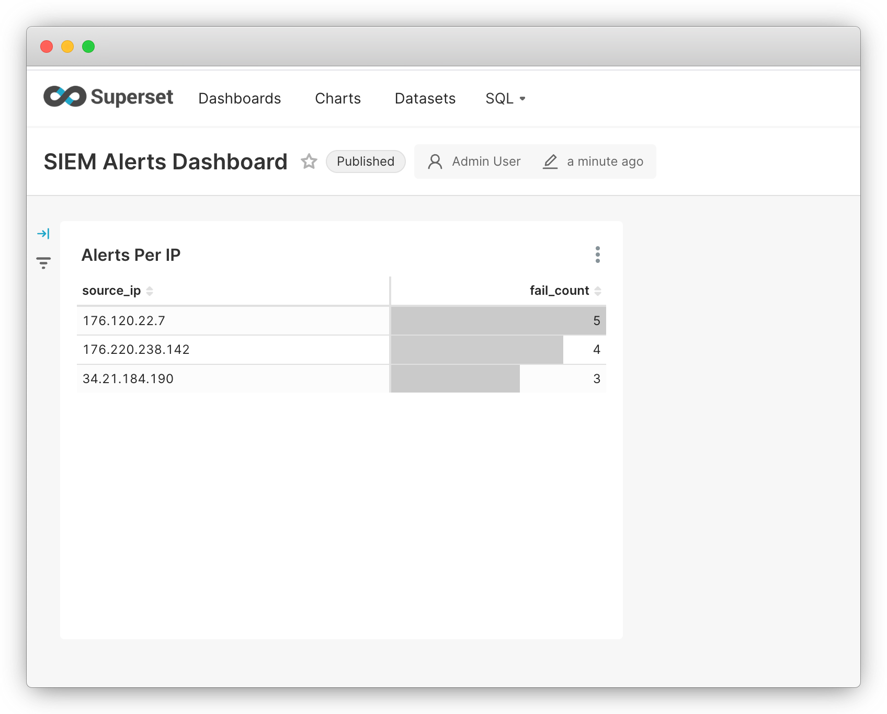

# Simulated SIEM 🛡️
A fully automated real-time SIEM (Security Information & Event Management) stack using Kafka, Flink, Airflow, PostgreSQL, and Superset.

---

## 🚀 Features

- 🔁 Synthetic data generation via Airflow DAG
- 📡 Kafka streaming of network events
- ⚙️ Apache Flink for real-time anomaly detection (brute-force login detection)
- 🔗 Kafka Connect for PostgreSQL sink (no manual consumers needed)
- 📊 Apache Superset dashboard with auto-generated time series chart
- ⚡ Fully dockerized & zero-config bootstrapped

---

## 📦 Stack

| Component       | Role                         |
|----------------|------------------------------|
| Kafka + Zookeeper | Event streaming            |
| Kafka Connect  | Sink anomalies to Postgres   |
| Flink          | Detect login failure spikes  |
| Airflow        | Schedule synthetic log events|
| PostgreSQL     | Store detected anomalies     |
| Superset       | Visualize alerts dashboard   |

---

## 📂 Folder Structure

```
.
├── airflow-dags/                          # Airflow DAGs for network event generation
├── flink-jobs/                            # Flink streaming jobs for anomaly detection
│   ├── src/                               # Java source code
│   │   └── main/java/com/siem/
│   │       ├── model/
│   │       │     └── NetworkEvent.java    # Network Event Data model
│   │       └── SecurityAlertsJob.java     # Brute Force Detection Flink Job
│   ├── pom.xml                            # Maven project configuration
│   └── DockerFile                         # Dockerfile for job deployer
├── kafka-connect-setup/                   # Kafka Connect configuration
│   └── postgres-sink.json                 # PostgreSQL sink connector config
├── superset-setup/                        # Superset initialization
│   ├── dashboards/                        # Pre-configured dashboards
│   ├── init_superset.sh                   # Initialization script
│   └── superset_config.py                 # Superset configuration
├── .env                                   # Environment variables
└── docker-compose.yml                     # Container orchestration
```

---

## 🛠️ Setup Instructions

1. **Create Environment File**

   Copy the sample environment file and configure as needed:

   ```bash
   cp .env.sample .env
   ```

   Default environment variables:
   ```properties
   # Airflow Configuration
   AIRFLOW_WEBSERVER_PORT=8080
   AIRFLOW_WEBSERVER_SECRET_KEY=airflow
   AIRFLOW_USERNAME=admin
   AIRFLOW_PASSWORD=admin
   AIRFLOW_POSTGRES_USERNAME=airflow
   AIRFLOW_POSTGRES_PASSWORD=airflow
   AIRFLOW_POSTGRES_DB=airflow

   # Kafka Topics
   KAFKA_TOPIC_NETWORK=network.logs
   KAFKA_TOPIC_ALERTS=alerts.security

   # Service Ports
   KAFKA_CONSOLE_PORT=8081
   KAFKA_CONNECT_UI_PORT=8082
   FLINK_PORT=8085

   # Sink Database
   SINK_POSTGRES_USERNAME=airflow
   SINK_POSTGRES_PASSWORD=airflow
   SINK_POSTGRES_DB=siem

   # Superset Configuration
   SUPERSET_PORT=8084
   SUPERSET_USERNAME=admin
   SUPERSET_PASSWORD=admin
   SUPERSET_SECRET_KEY=airflow
   ```

2. **Add JDBC driver**

   Download [PostgreSQL JDBC driver](https://jdbc.postgresql.org)  
   and place the `.jar` file into:

   ```bash
   ./connect-plugins/
   ```

3. **Start Everything**

   ```bash
   docker-compose up --build
   ```

4. **Visit the UI**

| Service       | URL                     | Login              |
|---------------|-------------------------|--------------------|
| Airflow       | http://localhost:8080   | `admin / admin`    |
| Kafka Console | http://localhost:8081   |                    |
| Kafka Connect | http://localhost:8082   |                    |
| Superset      | http://localhost:8084   | `admin / admin`    |
| Flink         | http://localhost:8085   |                    |

---

## 📊 Dashboard Preview



Superset will automatically include:
- 📈 Time-series chart of alerts on per ip basis
- 🔍 Queryable `alerts_security` dataset

---

## 🧪 Alert Logic

> Detected by Flink every minute

- 3+ `LOGIN_FAILED` events from same `source_ip` = 🚨 Brute-force alert

---

## 📜 License

MIT License
